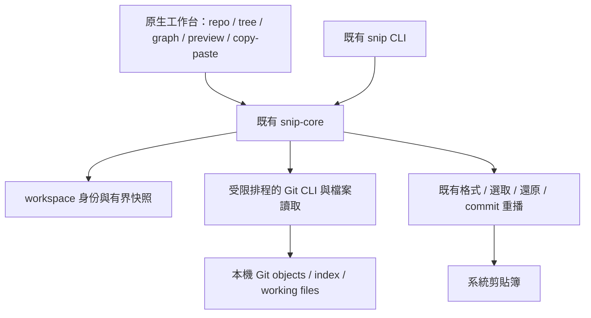

# 輕量 Git／檔案檢視工作台：完整規劃

> 註:Tauri 版(`crates/desktop`)與其 driver(`bench_tauri_memory.py`、`measure_tauri.sh`、Tauri E2E)已從 repo 移除;本文提到它們建置、測試或量測的段落是當時的紀錄,回退請取 git 歷史。

日期：2026-09-25。狀態：**已授權分階段實作；目前有未驗收原型，尚未完成效能驗證或正式切換**。

最新交付順序與驗收依 [native-workbench-delivery-spec.md](native-workbench-delivery-spec.md)，監督結果依 [native-workbench-supervision.md](native-workbench-supervision.md)。

本文件描述下一階段產品；目前已發布行為仍以 [spec.md](spec.md)、[plan.md](plan.md) 與 [porting-notes.md](porting-notes.md) 為準。文中的記憶體數字是待驗證的產品目標，不是現有版本或 GPUI 的量測成績。

## 1. 產品目標與決策摘要

**讓使用者用很低的記憶體成本，看懂多個 repo 的檔案與 Git 狀態，準確選出要複製的內容，再到另一台電腦預覽並貼上。**

主要使用情境：同一工作區開啟約 15 個團隊 repo；agent 在外部修改程式，使用者在這裡檢查分支、commit、staged／unstaged、內容差異，決定同步什麼。

建議方向：

1. 保留現有 Rust `snip-core`、CLI、剪貼簿協定與還原規則。
2. 原生介面以 **Rust + GPUI** 為優先驗證方案；GPUIX 作為需要 React 開發效率時的比較候選。
3. 用相同工作負載比較現有 Tauri 與原生原型；通過三平台、互動、相容性和記憶體門檻後才切換正式版。
4. 先設計 15 repo 的資料生命週期與全域資源上限，再增加介面功能。
5. 以自己的 VS Code 外掛作為操作及複製行為參考，Fork 作為分支圖可讀性的參考，Orca 作為載入、快取與背景工作管理的參考。

這次需求比「通用 IDE」明確，主要是資料讀取、圖形呈現與既有同步操作；值得驗證純 Rust UI，減少常駐執行環境。不因框架宣稱輕量就預先認定結果。

## 2. 功能邊界

### 必須具備

| 區域 | 功能與結果 |
| --- | --- |
| 工作區 | 多個資料夾、15 個 repo 概覽、巢狀 repo／submodule／worktree 辨識 |
| 檔案 | 可展開的樹、Git 裝飾、文字預覽、語法高亮、行號、搜尋目前檔案、跳行、選取複製 |
| 歷史檔案 | 不切換實際 checkout，就能查看任意已取得 commit 的檔案樹與內容 |
| Git 概覽 | 各 checkout 的目前分支、staged／unstaged／untracked／conflicts、進行中 Git 操作、資料新鮮度 |
| 分支 | local／remote-tracking branches、tags、HEAD、upstream、ahead／behind、worktree 所在分支 |
| Commit graph | 分岔與合併、refs 標籤、分支聚焦、搜尋、鍵盤導覽、範圍選取、摺疊合併路徑 |
| 差異 | staged、unstaged、commit、兩個 revision 比較；單欄及左右對照；新增／刪除／rename 等狀態 |
| 複製 | 選檔案、資料夾、變更、commit 或區間，明確顯示來源與預計複製內容 |
| 貼上 | 明確指定目的 repo／資料夾，預覽路徑、內容與操作，再沿用既有還原或 commit 重播 |
| 桌面品質 | 繁中／英文、鍵盤操作、中文輸入、縮放、多螢幕、剪貼簿、系統匣、三平台發布 |

### 本次不納入

程式編輯器、LSP、語意索引、編譯／執行／debug、terminal、Python／Node 環境管理、IDE 擴充市場、agent session 管理、網路同步服務、全工作區常駐內容索引。

Git 寫入維持既有貼上與 commit 重播。一般 stage／unstage、commit、checkout、push、merge、rebase 等管理操作不因「像 Fork」而自動加入。檢視其他分支使用 Git objects，不修改 agent 正在工作的 checkout。需要刷新遠端資訊時，可加入明確的手動 fetch；不背景自動 fetch，也不把本機 remote-tracking refs 當成即時伺服器狀態。

## 3. 先把 repo、package、worktree 分清楚

| 實際結構 | 介面與資料語意 |
| --- | --- |
| 一個 Git repo 裡有多個 package | 一張 Git graph；package 是檔案／路徑篩選，不產生假的分支 |
| 一個資料夾下有 15 個獨立 repo | 一個工作區、15 組 Git 狀態與各自的 graph |
| repo 中有獨立巢狀 repo | 檔案樹標出邊界；獨立 Git 群組；避免父子重複選取 |
| submodule | 父 repo 顯示 gitlink 變更，子 repo 顯示自身 checkout 狀態；未初始化時明確標示 |
| 同一 repo 多個 worktree | 共用 object store／refs，分別顯示 HEAD、index、工作目錄、操作狀態 |
| detached HEAD／尚無 commit | 使用明確標籤；不假造分支或假定 HEAD 一定存在 |

**Staged／unstaged 屬於 checkout／worktree，不是每個分支各有一份。** 沒被 checkout 的分支仍能看 tip、歷史、upstream 與比較結果；若它在另一個 worktree，就連到該 worktree 的變更。

工作區儲存有順序的 roots；Git repository 以解析後的 common directory 辨識，worktree 以自己的 git directory 與工作目錄辨識。顯示名稱、實際路徑、repo-relative path、workspace-relative path、剪貼簿 header path 分開處理。

不可把所有平台路徑一律轉小寫去重。需涵蓋 Windows 大小寫／分隔符、Linux 大小寫不同目錄、macOS symlink root、`.git` 檔案、空白／Unicode／換行檔名及重複 basename。Git 路徑輸出使用 NUL 分隔，非 UTF-8 路徑不可經過有損轉換後拿來寫入。

### 探索方式

先顯示已知 roots 與直接子資料夾，再漸進探索 nested repo、`.gitmodules` 與 worktrees；同一次探索讓多個面板共用。預設跳過依賴、產物與 `.git/objects` 等龐大目錄，不跟隨 symlink 無限遞迴。

探索有取消、進度、深度與工作量上限。達上限顯示「探索尚未完整」並可繼續或手動加入，不能把未找到顯示成不存在。被探索排除的目錄仍可手動加入；一般檔案樹也能切換顯示 ignored 檔案。第一版不解析各語言建置模型；常見 workspace manifest 的 package 標籤只在實際有助導航時補上。

## 4. 介面與使用流程

```text
┌ 工作區：Team                    搜尋 repo / branch / commit       ┐
│ Repo／檔案              │ Git 歷史／檔案閱讀                      │
│ ▾ api  main             │ [全部 refs] [聚焦分支] [比較] [搜尋]    │
│   staged 3  unstaged 2   │ ●── merge       main origin/main       │
│ ▾ web  feature/login    │ │ ● fix login   feature/login          │
│   staged 0  unstaged 8   │ ●─┘ base commit                        │
│ ▸ infra  main           ├────────────────────────────────────────┤
│   clean                 │ commit 資訊／變更檔案 │ 內容／diff      │
│ [檔案] [分支] [變更]    │ A src/a.ts            │ - 舊內容       │
│ 展開目前 repo 的樹      │ M src/b.ts            │ + 新內容       │
├─────────────────────────┴────────────────────────────────────────┤
│ 待複製：2 repos / 5 files / 來源與排除原因          [預覽] [複製] │
│ [複製檔案] [複製 commits] [貼上預覽]                            │
└──────────────────────────────────────────────────────────────────┘
```

版面可調整寬度，保留各 repo 的選取與捲動位置；預覽面板可切換成較大的閱讀區。預設只維持一個檔案／diff 預覽，選取下一檔時替換；不因點過很多檔案就保留所有內容。

### A. 判斷現在發生什麼

1. 開啟工作區，先看 15 repo 摘要。
2. 選 repo 後立即顯示該 worktree 的 staged／unstaged 與 graph。
3. 查看分支從哪裡分出、合併到哪裡、哪些 commit 尚未在 upstream。
4. 點 commit 看 message、作者、時間、parents、變更檔案與 diff；可查看該 commit 的完整檔案樹。

### B. 決定複製什麼

1. 從檔案樹、變更樹或 graph 選取。
2. 待複製區持有 repo、來源 revision／index／working tree、相對路徑等識別資料，不預讀所有內容。
3. 預覽列出會複製的檔案、刪除標記、來源、大小，以及 binary／filter／limit 等排除原因。
4. 複製時固定 commit OID；可變來源若已改變，重新整理預覽，避免來源悄悄換掉。

單一檔案同時出現在 staged 與 unstaged 時，兩列保留；選取同一路徑的兩種版本必須決定一種，不能在 payload 中用重複 header 偷渡兩份。

### C. 到另一台電腦貼上

1. 解析剪貼簿，選目的 workspace／repo。
2. 多 repo 檔案按來源群組顯示目的路徑；同名 repo 無法可靠推定時，要求完成明確 mapping。
3. 在預覽中看新增、覆蓋、刪除、跳過及各自原因。
4. 套用前確認目標仍對應原先的 checkout／HEAD 與預覽狀態；有變更就更新計畫。
5. 顯示逐項結果；失敗不宣稱全部成功。

沿用既有覆蓋語意，不承諾三方合併、衝突自動解決、檔案模式逐位元組還原或整批 rollback。多 repo commit 重播先保持「逐 repo 的既有 payload 與明確目標」；不自創無法與舊工具互通的跨 repo commit envelope。

## 5. Git 檢視的正確性

| 視圖 | 應代表的資料 |
| --- | --- |
| Staged | HEAD → index；內容從 index 讀取 |
| Unstaged | index → working tree；包含已追蹤檔案的工作目錄變更 |
| Untracked | 未追蹤檔案為獨立來源，Changes 中列在 Unstaged 群組下並以檔名顏色區分，可選擇複製 |
| Conflicts | unmerged stages／衝突狀態獨立顯示，不當作一般 staged |
| 單一 commit | 明確標示所比較 parent；root commit 比空樹 |
| Merge commit | parent 切換檢視與既有多 parent 複製語意分開呈現 |
| 兩 revision | 明確區分端點差異 A→B、commit 集合 A..B、merge-base 比較；不共用含糊標籤 |
| Ahead／behind | 相對設定的 upstream 或使用者選定的比較分支，未知則顯示未知 |
| Remote branches | 本機 remote-tracking refs；標示最近取得資料的時間 |

目前 `Working` 複製來源是既有相容語意，包含 working/index 等變更集合，不能直接改名「Unstaged」冒充相同概念。新視圖建立正確的來源模型，serializer 維持契約；新增來源行為需有對應測試與文件。

錯誤、讀取中、舊快照、clean 是不同狀態。Permission denied、Git timeout、index.lock、repo 被移走，都不能顯示為乾淨的空清單。某一 repo 失敗不阻塞另外 14 個。

### 分支圖的交付標準

- local、remote-tracking branches、tags、HEAD 與未提交變更入口清楚可辨。
- 真正的 parent edges、merge junction、octopus merge；採穩定拓撲順序，不只按 commit 日期排序。
- 同一快照下換頁／往回捲動，lane 與顏色保持穩定；ref 更新建立新快照，保留選中的 OID 與視覺錨點。
- 搜尋與路徑篩選不偽造親子關係：省略的中間歷史畫明確連接提示，可返回原始 graph。
- 尚未載入 parent、shallow boundary、已摺疊路徑有不同標記；不能看起來像歷史終止。
- 點 branch 聚焦其歷史；定位 HEAD、輸入 SHA、branch／author／message 搜尋；未知 SHA 清楚回報。
- 合併路徑可摺疊／展開，保留摺疊內容與範圍提示；預設不悄悄隱藏分支。
- 分支很多時可水平捲動與聚焦，不縮成看不懂的細線；顏色之外有文字／線型訊息。
- 同 repo 才有連線。跨 repo 概覽以群組摘要呈現，搜尋結果附 repo；不把 15 組歷史連成一張假的 DAG。
- commit 重播選取需通過既有 first-parent 連續性規則；graph 多選不等於任何集合都能重播。

Fork 的合併摺疊讓使用者看清一條功能分支的開始、內容與合併位置，這是可讀性參考；不需要把它的所有 Git 寫入功能一起帶入。[Fork 官方說明](https://git-fork.com/blog/posts/collapsible-graph/)

## 6. 現有程式與參考來源怎麼沿用

參考固定在 ClipCodeVSCode `0aa24c8`，從 Git object 抽到 gitignored `.ts-ref/`；不以 sibling checkout 當權威。現有 snip-sync 檢查基準為 v0.1.4／`c06f4ff`（功能整合 commit `9be8684`）。

| 已檢查來源 | 可沿用內容 | 遷移需調整 |
| --- | --- | --- |
| `.ts-ref/src/graphCopy.ts` | repo／workspace／clipboard 路徑分工、批次讀取、刪除前內容、去重與限制 | 全域限制跨 repo 並行與總配置量 |
| `.ts-ref/src/historyView.ts` | repo 切換、歷史檔案選取與複製流程 | VS Code Git／workspace API 改由 Rust 提供 |
| `.ts-ref/graph/src/git/git-graph-builder.ts` | SourceGit 衍生的 path／link／dot 排版、分支著色及可達性邏輯 | 從完整陣列計算改為有界快照／分頁；保留相同行為的 golden 測試 |
| `.ts-ref/graph/webview-ui/src/components/graph/CommitGraph.svelte` | 可視區列／線條裁切、鍵盤焦點、選取與導覽互動 | SVG／Svelte 呈現改為 GPUI；資料本身也要有上限 |
| `.ts-ref/graph/src/services/repo-discovery.ts` | roots 快速顯示、漸進探索、共享進行中的掃描、重名處理 | 平台正確的路徑身份；有界掃描與並行 |
| `.ts-ref/graph/src/workbench/workbench-status.ts` | 按 repo 分組與錯誤隔離 | 不在總覽用 Promise.all 掃每個 repo／每個檔案的完整 diff |
| 現有 `crates/core` | format、paths、restore、Git plumbing、commit 重播、contract tests | 擴充 workspace 模型及讀取資源限制，避免另寫第二套核心 |
| Orca 檔案與 Git 模組 | lazy directory、virtual rows、diff LRU、Git admission、hidden polling、cleanup | 採用方法，參數依本產品量測；不搬 Electron／Monaco／terminal |

參考程式的虛擬捲動不代表資料記憶體已被限制。原圖形 builder 仍接收完整 commit 陣列；snip-sync 的 `commit-timeline.tsx` 也會把載入分頁累積在 state。兩者都需要補上資料淘汰，不能只換原生畫圖。

目前 `browser.rs` 的 working file preview 在讀取時限制 1 MiB；Git preview 則先讀內容才檢查長度。後者及 diff 子程序輸出需要改為配置前限制。這是程式碼發現的風險，尚未證明是使用者目前高 RAM 的主因。

沿用程式碼時保留原有授權與來源：vendored graph 有 Apache-2.0 LICENSE，而 graph builder 另有 SourceGit MIT attribution；逐檔保留適用 notices。Fork 僅參考互動與視覺可讀性。

Orca 已檢查的代表位置：

- `src/renderer/src/components/right-sidebar/FileExplorerVirtualRows.tsx`
- `src/renderer/src/components/right-sidebar/useFileExplorerTree.ts`
- `src/main/git/source-control/settled-diff-cache.ts`
- `src/main/git/command-runner/git-admission-state.ts`
- `src/main/ipc/worktree-git-common-polling.ts`

## 7. 底層選型與原型關卡

| 方案 | 對本產品的好處 | 需要承擔的成本 | 定位 |
| --- | --- | --- | --- |
| 現有 Rust + Tauri | 發布、桌面整合、測試與現有 UI 可用 | WebView 固定成本及前端資料配置仍存在 | 實測基線、遷移期間穩定版 |
| Rust + GPUI | Rust core 直接連接 UI；無 WebView／JS runtime；資料所有權較直接 | 原生元件、IME、accessibility、三平台打包與 E2E 都要驗證 | **優先原型** |
| Rust core + GPUIX | React／TS 寫法，使用 GPUI 渲染 | 仍有 JS runtime 與 binding 邊界；DOM 元件需改寫；pre-1.0 版本風險 | 比較候選，不預設採用 |

GPUI 是 Rust UI framework，並不等於整個 Zed 編輯器；選用它不表示需要載入 Zed 的 LSP／語言專案系統。[GPUI 官方](https://gpui.rs/)

GPUIX 官方明確說明透過 GPUI 繪製、沒有 DOM／WebView，並要求 adapter 與 native 套件鎖相同版本。它保留 React 狀態模式，無法原封不動沿用 HeroUI、rc-tree、網頁 Git graph 等元件。文件中的 `.app` 大小不是本產品執行時 RAM 成績。[GPUIX 官方 repository](https://github.com/remorses/gpuix)

### P0 必須回答的問題

用一個最小但真實的垂直原型：15 repo 摘要 → 選 repo → graph → 選檔案 → 高亮／diff → 剪貼簿複製／貼上。不要只比較空白視窗。

- 指定 GPUI revision、建置環境與 component 依賴；確認三平台編譯、實際視窗與安裝產物。
- 驗證中文輸入／選字、系統字型、文字選取、copy、快捷鍵、縮放、多螢幕、檔案選擇與系統匣。
- 驗證鍵盤 focus 與基本 accessibility；平台缺口要有可實施方案。
- 建立 native 真實視窗 E2E，驗證能定位 controls、輸入、捲動、讀取結果，而非只 call core。
- 量測同一資料、相同功能、相同機器的 Tauri 與 GPUI footprint／peak／CPU／互動延遲。
- 如 GPUI 原生元件成本成為主要障礙，才對相同垂直原型比較 GPUIX；不維護三套完整產品。
- 選定方案需達到記憶體預算，且 15 repo 活動情境的穩態 footprint 比基線至少下降 30% 作為初始切換門檻；若基線本來已很低而未達比例，需重新論證重寫價值，不能只憑框架偏好。

目前執行環境是 Linux；未在實體 macOS／Windows 上量測的項目一律標示未驗證。框架支援列表、headless renderer 與真正 GUI E2E 是不同證據，不能互相替代。

## 8. 最小架構與資料生命週期



在現有 core 裡加必要模組；原生 UI 使用一個新的 desktop crate（實際名稱在 P0 決定）。不另開 localhost HTTP server、daemon、資料庫或通用 plugin host。沒有編輯需求就不嵌完整 editor engine。

### 快照與背景任務

- UI 只持有當前顯示資料與選取 ID；Git／檔案 I/O 不在 UI thread 執行。
- 初始 Git 執行預算：全程最多 2 個 Git 子程序，單一 worktree 同時最多 1 個重工作；互動需求優先，背景輪替避免飢餓。這是待量測參數。
- 批次 blob 讀取共用受此總額管理的 `cat-file` process，空閒回收，不為 15 repo 各留一個程序。
- 全域 queue 有界；重複 refresh 合併，切 repo／換選取取消過期工作；取消需停止讀取並回收實際子程序，不只忽略回傳值。
- stdout、stderr、blob、diff、目錄頁、refs 與 graph frontier 都有限制；子程序 timeout、取消及超限可區分。
- commit object 內容用固定 OID 快取；mutable index／worktree 結果用 repo／worktree 身份與 generation 管理，不只靠 mtime 判斷。
- 外部 agent 修改或切分支時，舊請求不能覆蓋新畫面；複製／套用前重新驗證來源或目的狀態。一般 filesystem 無跨檔原子快照，因此不承諾與外部寫入同時發生時的原子一致性；偵測變動需重試或停止。

### 監聽與更新

- 同一 common directory 的 refs 監聽可共用；每個 worktree 的 index／HEAD／工作目錄狀態分開。
- 活躍 repo 更新細節，背景 repo 只更新必要摘要，不算全部 file diff 或全部分支兩兩比較。
- 工作目錄 watcher 僅對需要的範圍工作；漏事件以低頻、受限的摘要刷新補足，提供手動刷新。背景摘要標出時間，不能暗示永遠即時。
- window hidden 時停止非必要輪詢與渲染；回前景刷新。避免每個 repo 的獨立 timer 同時啟動一輪重掃。
- 關閉工作區解除 watcher／訂閱／快照／cache／子程序；保留小型 UI 偏好，不保留已讀內容。

## 9. 記憶體預算與可量測指標

Rust 提供記憶體安全工具，但不能阻止無界 Vec、Arc cycle、快取、子程序或 GPU 資源消耗。**語言選擇與產品的記憶體上限必須分別驗證。**

### 整個應用的初始產品目標

基準：release build、固定參考機器、固定視窗尺寸／縮放、15 repo 標準資料集；穩態在該步驟完成後空閒 30 秒量測。數字均為 MiB。

| 情境 | 初始目標 |
| --- | --- |
| 空白工作台 | ≤ 100 |
| 1 repo，基本 graph／摘要已載入 | ≤ 160 |
| 15 repo 概覽，沒有背景重工作 | ≤ 256；相對同測試 1 repo 增量 ≤ 96 |
| 15 repo，活躍檢視 graph 與一般 code diff | 穩態 ≤ 384 |
| 預設限制內複製／貼上預覽 | 瞬間峰值 ≤ 512 |
| 收到系統匣、釋放重資料後 | 暫定 ≤ 100；GPU／window 是否可回收由 P0 驗證 |

上述是「一般資料集的發布目標」，不是任意大小 Git repository 都能保證的 OS hard cap。對惡意或極端資料需依配置前檢查、輸出限制、取消與退化呈現維持可控，不靠吃完 RAM 後才警告。

### App 自己保留的重資料

先採 **64 MiB 全域 retained-data budget**：

| 區域 | 初始分配 |
| --- | --- |
| 文字內容與 diff | 32 MiB |
| graph 頁、refs 與 layout checkpoint | 16 MiB |
| 展開目錄與變更清單 | 8 MiB |
| 高亮結果等可重建衍生資料 | 8 MiB |

這不包含框架、字型、GPU、allocator、子程序及暫時的 clipboard payload，因此不能用 64 MiB 代替整體量測。快取按配置 bytes 計價，不能把 JavaScript 字元數當 bytes；共享內容避免重複記帳或複製。

具體策略：

1. **15 repo 常駐摘要，共用一組可視內容資源。** 切 repo 保留位置與選取，淘汰內容。
2. **畫面與資料皆虛擬化。** Graph 的舊頁會淘汰；帶 OID／ref 快照及 lane 邊界的 checkpoint 支援回讀，不用每次追加就重算／永久保存全部歷史。
3. Graph 的 lane frontier 也有上限。極端寬 graph 超限時提供聚焦分支或明確的歷史清單退化模式，不丟掉 parent 後畫錯圖。使用者仍可搜尋／逐段查看所有可用歷史。
4. 目錄與 refs 漸進讀取，UI 列有界。巨型單一目錄不能為了排序無限配置；到界顯示受限與搜尋／篩選入口。避免一開始建立完整 repo 檔案索引。
5. 預覽預設延續 1 MiB 單檔上限；大檔顯示資訊與原因，可提供受限片段。高亮失敗／過大退為純文字，不影響原本允許的檔案複製。
6. Blob 先檢查 object size 再讀；diff 兩側與 Git 輸出皆有限制。超長單行、巨大刪除檔、rename 偵測最壞成本都要能取消。
7. 語法高亮按語言及目前檔案載入；優先使用選定 UI 套件可用的簡單 highlighter。若缺少才加入最小需要的 grammar 方案，不啟動 LSP 或預解析整個工作區。
8. clipboard 建構集中 Rust；減少中間 String clone，預覽傳摘要與分頁內容。OS 剪貼簿可能要求完整資料並自行持有副本，必須計入測試，不能宣稱 streaming 就沒有峰值。
9. 現有預設複製為最多 30 檔、每檔 500 KB；使用者放寬設定時，不再假設 payload 小。P0 訂出總 payload 的安全 admission 上限，在配置前說明並拒絕整筆超限，不能截斷後回報成功。新增總量限制屬行為變更，需在 spec／porting-notes 明載，保留既有格式與設定數值語意。
10. 收到系統匣可釋放 graph／diff／highlight；若 renderer 仍持有高固定成本，驗證銷毀視窗、重開時還原小型 UI state 的成本。不得因此丟失待複製選取。

### 測量方式

- Linux 記錄 PSS 及 RSS；macOS 記錄 physical footprint；Windows 記錄 private working set 與 private bytes／commit。各平台獨立訂門檻，數值不跨指標直接相除。
- 包含 app 與歸屬它的 renderer／JS runtime／Git 子程序；另列 GPU allocations。共享頁及 unified memory 避免重複相加；OS 剪貼簿持有的額外成本單獨記錄。
- 記錄峰值、穩態、Git 程序數、pending jobs、cache bytes、watchers、載入 objects／rows、CPU idle。用高頻採樣配合 OS high-water 指標，避免錯過短峰值。
- 冷啟動與暖啟動分開；相同 profile 重複 10 次，報 median／p95 及最壞峰值。初始化索引與快取預熱規則固定。
- 100 次 repo 切換與預覽關閉後，保留資料必須回到預算；程序 footprint 應進入平台穩定區間，不要求 allocator 每次立即歸還所有頁。
- 初始互動目標：暖資料選取回饋 p95 < 100 ms；第一屏普通預覽 p95 < 300 ms；graph 捲動 p95 frame time < 20 ms。冷 Git 操作另列耗時，期間必須可取消且 UI 可回應。
- 另與使用者實際 IntelliJ 工作區作同機量測；需記錄 plugins／indexing／語言服務狀態。不能用未完成量測的倍率作宣傳。

## 10. 更嚴格的 CI／E2E

保留現有全部 real-app scenario 的語意與 contract tests。原生 UI 將選擇器換成穩定的 control identity／accessibility identity；Tauri 過渡期新控制項照現有規則加 `data-testid`。

### 必測案例

| ID | 情境 | 必須驗證 |
| --- | --- | --- |
| W01 | 同時開 15 repo | 每個 branch／staged／unstaged 摘要與真實 Git 一致，程序數不超限 |
| W02 | 單 repo 多 package、巢狀 repo、submodule、linked worktree | 分組、身份、gitlink／子 repo 狀態正確，不重複掃描 |
| W03 | 同名 repo、symlink、Unicode、Windows 路徑、大小寫差異 | 不錯 repo、不重複 root、不把 header 導向錯誤目的地 |
| W04 | agent 改檔、切分支、刪 repo，連續快速切換畫面 | 舊結果不覆蓋新快照，錯誤不顯示 clean，其他 repo 繼續可用 |
| G01 | branch／merge／octopus／root／detached／shallow | parent edges、refs、邊界與顯示狀態正確 |
| G02 | 捲過多頁、回捲、搜尋、摺疊後展開 | 固定快照 lane 穩定；parent 不錯接；資料與繪圖 rows 有界 |
| G03 | 同檔 staged A、working B，再 rename／delete／conflict | 預覽與複製來源正確，不把 index 與 working 混在一起 |
| G04 | local／remote-tracking／tags、upstream 缺失或資料舊 | 標籤、ahead／behind、freshness 與未知值正確 |
| F01 | 任意 commit 檔案樹、binary、大 blob、超長單行 | 不切 checkout；不超限配置；高亮退化可理解 |
| C01 | 跨 repo 選檔 → 真剪貼簿 → 另一 workspace 貼上 | headers 與契約一致，目標 mapping、內容、刪除與跳過正確 |
| C02 | root／merge／first-parent commit 區間重播 | 既有 metadata／檔案行為一致；非連續及跨 repo 集合不誤接受 |
| C03 | 複製或套用前來源／目的 checkout 改變 | 預覽失效可見，不向另一分支悄悄寫入 |
| M01 | 100 次 repo／preview 切換、工作區移除、收起／重開 | cache、watcher、child process、subscriptions 可回收 |
| M02 | 超量 blob、diff、refs、目錄、複製 payload | 配置前限制生效；取消能回收；不截斷成功、不 OOM |
| U01 | 中文 IME、鍵盤、縮放、無障礙焦點 | 真視窗可操作，主流程無滑鼠也能完成 |

### 測試資料與分層

- 標準負載：15 repo，每個至少 10,000 tracked paths、20,000 commits、100 refs，包含乾淨／dirty／rename／delete／untracked 情境；通常只看一個 repo 的細節。
- 壓力負載另外加入大型歷史、數千 refs、10,000 changed files、巨型單目錄、巨大 blob、長行及大量 merge。可用程式生成，不把大型資料放進 repository。
- Core integration tests 建真 Git repo，比對 Git plumbing oracle，測來源內容、取消、stdout 限制與路徑語意。
- Graph golden／property checks 測拓撲與分頁一致性；不只比較截圖，也驗證顯示 edges 對應真 parent、摺疊／篩選有正確標記。
- 真 app E2E 透過 UI 選取／複製／貼上，再檢查真剪貼簿與目的 Git／檔案；UI mock 不能替代這條鏈。
- Linux 可重現 symlink 等跨平台邊界，但仍要跑 Windows／macOS 原生行為；缺 display、driver、Git 或 reference 時必須 fail required gate，遵守 `SNIP_REQUIRE_ALL_TESTS`，不能 skip 成綠燈。

### CI 層級

1. 每個 PR：既有 Rust／相容性／CLI gates，加 native compile、graph checks、核心資源上限與代表性真 app E2E。
2. Linux `just preflight` 納入能在本機跑的所有新增 gate；每次 push 前執行，不將原生新增項目藏在 CI 才第一次跑。
3. 發布候選：三平台真 app 核心流程及安裝 smoke；固定硬體跑完整 15 repo 記憶體與 soak，結果附 revision／環境／資料集。
4. 共用 runner 的時間與 RAM 噪音不能當精準產品量測；CI 檢查 deterministic 資源上限，固定 runner 報告絕對 footprint 與退步。沒有必要硬體或報告就不能宣稱通過發布效能門檻。

## 11. 分階段交付

| 階段 | 交付內容 | 完成門檻 |
| --- | --- | --- |
| P0 基線與原生驗證 | 固定資料集、Tauri baseline、GPUI 垂直原型、必要時 GPUIX 比較、native E2E 路徑 | 選型報告有實測；三平台核心能力可行；預算與缺口具體可追蹤 |
| P1 多 repo 核心 | repo／worktree 身份、漸進探索、staged／unstaged 正確模型、全域排程、取消、讀取限制 | W01–W04、G03 與 M02 核心檢查通過；錯誤不冒充 clean |
| P2 原生閱讀工作台 | 檔案樹、15 repo 概覽、文字與高亮、staged／unstaged diff、語言與桌面整合 | 能實際看懂並選檔；F01／U01 與記憶體基礎門檻通過 |
| P3 優秀的 Git graph | 移植 graph 邏輯、refs、parent、分支聚焦、比較、搜尋、分頁與摺疊 | G01–G04；graph 可讀性人工驗收及有界資料量測 |
| P4 複製／貼上完整整合 | 待複製區、多 repo 檔案來源、目的 mapping、來源新鮮度、commit 重播整合 | C01–C03、既有全 scenario 與 immutable contract 全綠 |
| P5 效能、跨平台與發布 | 15 repo soak、包裝、設定遷移、安裝／回退、CI 與發布流程更新 | 三平台 gates、記憶體報告、核心相容性均通過，才切正式版 |

P0 不做完整重寫；用最小的真實流程決定原生方向。P1 與後續 UI 共用既有 core，避免兩套功能漂移。P3 的 graph 資料正確性可先用純 Rust tests 驗證，再接原生繪製。

第一個可用原生預覽版需包含 P0–P2 及基本 graph／既有複製流程；完整正式切換需要 P3–P5。不能把只有檔案樹的預覽版當成這次「出眾 Git 能力」已完成。

## 12. 相容性、發布與回退

- `fixtures/clipboard-contract.json` 與 SHA 原樣保留；新 UI 不改檔案 wire format。
- 保留原有 filtering、刪除前內容、root path、換行正規化、skip reason、root／merge／range／重播等語意。
- 若需與較新的外掛能力對齊，先更新固定參考 revision 與三個工具的共同契約流程，不直接讀 sibling HEAD 混用新舊行為。
- 新原生 preview 與穩定 Tauri 使用不同 app identity／設定位置，避免 single-instance、剪貼簿監聽或設定互相干擾；正式切換才一次性匯入設定並保留備份。
- 不需要讓兩套 UI 永久共存。切換後移除不再使用的 WebView／前端 build 依賴，保留上一版安裝包作回退。
- 更新 `docs/spec.md` 的產品範圍、`docs/plan.md` 的架構、`porting-notes.md` 的接受差異；這份提案不直接覆寫現在的發布規格。
- 更新 `just preflight`、版本同步、release build matrix、native bundle／tray／clipboard／single-instance 的 smoke；保留 CLI 與 Homebrew 發布。
- 仍走 feature branch → develop → main release PR；所有必要 CI 綠燈後，依既有 `just release X.Y.Z` 流程發布。版本號在切換範圍確認後決定。

## 13. 主要風險與停止條件

| 風險 | 處理方式／停止條件 |
| --- | --- |
| GPUI 的平台、IME、accessibility、測試工具不足 | P0 提早驗證；沒有實際解法就不切正式版 |
| 原生圖形仍保存完整歷史／文字 | retained bytes 與進程峰值同時驗證；只有 viewport 裁切不算通過 |
| Git 自身在大 repo 吃記憶體 | 限制並行、輸出與取消；分開量測 child cost，必要時降低工作量，不掩蓋在 app 數字外 |
| 移植 TS graph 後分頁畫錯 | 先固定 graph fixtures、parent oracle 與 boundary 語意；視覺和資料雙重驗證 |
| 多 repo 路徑被貼錯 | 固定 contract、明確身份與 mapping；有歧義就停在具體路徑預覽 |
| 高亮或 diff 成為新記憶體大戶 | 一個活躍預覽、全域 budget、超限純文字／片段呈現 |
| 外部 agent 持續改檔 | generation、來源 OID 與套用前重新驗證；不宣稱跨檔原子快照 |
| 多 repo 範圍膨脹成另一套 IDE | 功能必須直接服務看檔案、看 Git、選取與同步；其他能力另提需求 |

完整成功的判準：**在 15 repo 的真實工作情境，使用者可以清楚回答「哪個 repo／worktree、哪個分支、哪份內容、複製哪些、貼到哪裡」，並有量測證明整體資源使用符合預算。**
